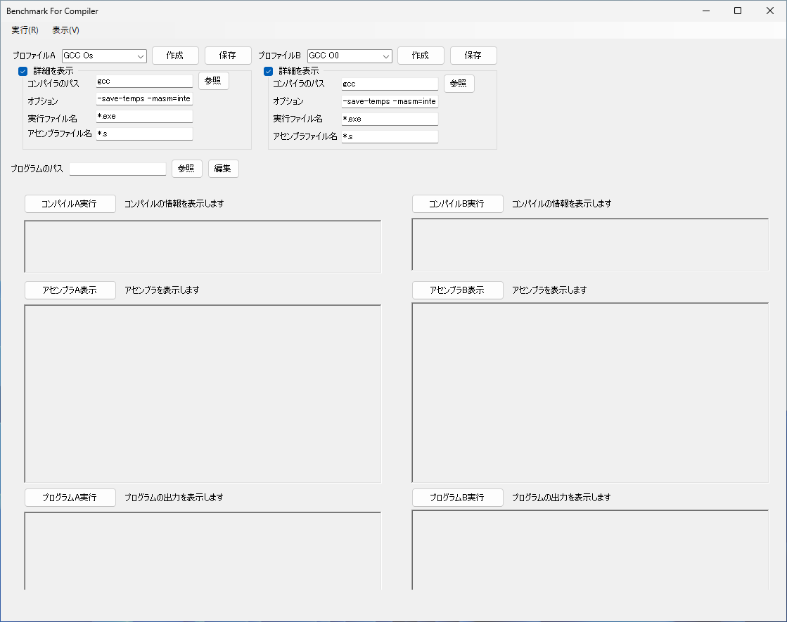
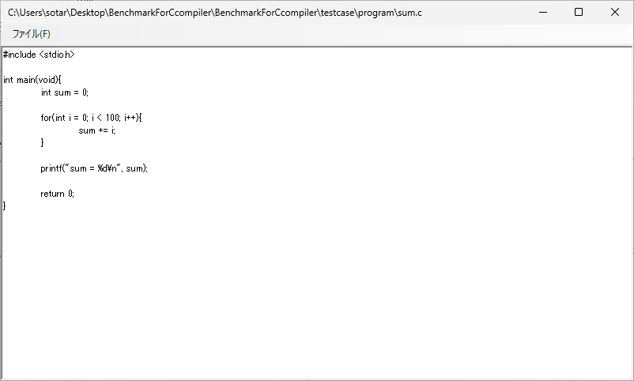
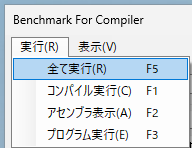
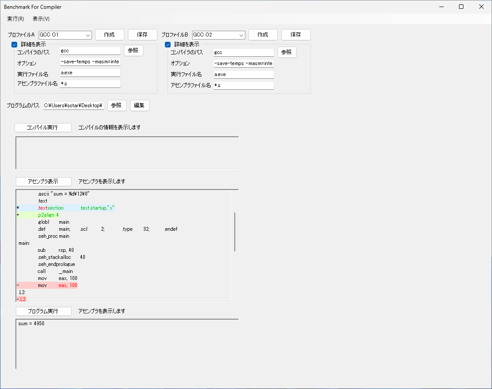
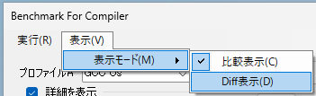

# 概要

# 機能
- 任意のソースコードをコンパイルし、実行することができる
- 中間ファイルのアセンブリコードを表示することができる
- コンパイル時の設定をプロファイルとして保存・読み込むことができる
- プロファイルの作成や編集、保存がおこなえる
- ソースコードの作成や編集、保存がおこなえる
- コンパイル結果、アセンブリコード、プログラム実行結果を分割画面で表示し、比較することができる
- コンパイル結果、アセンブリコード、プログラム実行結果をdiffで比較することができる

# 使い方
## ディレクトリ構成
このアプリのディレクトリ構成を次に示す
```
workfolder
|-- BenchmarkForCompiler.exe
|-- Profile
    |-- GCC O0
    |-- GCC O1
        ...

|-- SampleProgram
    |-- hello world.c
    |-- sum.c

```

## 起動方法
1. 「BenchmarkForCompiler.exe」ファイルをダブルクリック  


## プロファイルの選択、作成、保存
プロファイルとは、コンパイラを実行する時の設定ファイルです。`workfolder/Profile/`のディレクトリに保存されています。プロファイルを直接編集する場合は、このディレクトリの中のプロファイルをテキストエディターで編集すればよいです。アプリ上からもプロファイルの編集・作成・保存等の操作ができます。アプリ上での操作方法は主に3つあります。それぞれ説明します。



### 既存のプロファイルを使用する方法
1. 「プロファイルA」と「プロファイルB」のプルダウンリストから、任意のプロファイル名をクリックする
2. 「詳細を表示」のチェックを入れることで、今読み込まれているプロファイルの情報を表示することができる

### プロファイルの作成
1. 「プロファイルA」又は「プロファイルB」の右のテキストボックスに、プロファイルの名前を入力する
2. 「詳細を表示」のチェックを入れる
3. 「コンパイラのパス」を入力する
    - 実行するコンパイラがあるパスを入力する
    - パスが通っていないコンパイラの場合、絶対パスを指定する必要がある
4. 「オプション」を入力する
    - コンパイル時のオプションを入力する
    - アセンブリコードを生成するようなオプションを指定するとよい
5. 「実行ファイル名」を入力する
    - コンパイラによって生成される実行ファイル名を指定する
    - 実行ファイル名の拡張子だけを指定したい場合「*.exe」のように、アスタリスクを用いて入力する
6. 「アセンブラファイル名」を入力する
    - コンパイラによって生成される中間ファイルのアセンブリコード名を指定する
    - アセンブリコード名の拡張子だけを指定したい場合「*.s」のように、アスタリスクを用いて入力する
7. 「作成」をクリック

### 既存のプロファイルを編集する
1. 「プロファイルA」と「プロファイルB」のプルダウンリストから、任意のプロファイル名をクリックする
2. 「詳細を表示」のチェックを入れることで、今読み込まれているプロファイルの情報を表示することができる
3. 「コンパイラのパス」、「オプション」、「実行ファイル名」、「アセンブラファイル名」などのテキストボックス内を編集する
4. 「保存」をクリックする

## プログラムの選択
ここで説明するプログラムとは、コンパイラでコンパイルしたいソースコードのことを指します。
1. 「プログラムのパス」の右側のテキストボックスに、任意のプログラムを選択
2. 必要であれば「編集」ボタンをクリック
   - 簡易的なテキストエディターが開きます。
   - 本格的に編集したい場合は、VSCodeなどの専用のアプリで開き、編集してください。  
    

## 実行


### 一つずつ実行
1. 「コンパイルA実行」をクリック
    - コンパイルを実行します。
    - コンパイラによって、正しくコンパイルされると、何も表示しない場合があります。
2. 「アセンブラA表示」をクリック
    - アセンブリコードを表示します。
    - Intel記法のアセンブリを表示させたい場合などは、プロファイルの「オプション」で指定してください。
3. 「プログラムA実行」をクリック
    - コンパイルされた実行可能ファイルを実行します。
    - プログラムによって、何も表示されない場合があります。

### まとめて実行
1. メニューバーの「実行」をクリック
2. 実行するものを選択
    - ショートカットキーが使えます  
      

## 表示モードの変更
表示のモードには「比較表示」と「Diff表示」の２つのモードがあります。  
比較表示モードは、プロファイルAとプロファイルBの結果をそれぞれ左右に分割して表示させるモードです。  


Diff表示モードは、プロファイルAとプロファイルBの結果の差分を表示します。Aの結果が全て表示され、Bの結果はAの結果と異なる部分が表示されます。赤文字はAにはあるが、Bにはない文字列、緑文字はAにはないが、Bにはある文字列を表しています。文字列の背景色は、行全体の情報が表されています。赤色、緑色は文字の色と同様の意味を表しています。青色の背景は、赤色と緑色の文字の両方が含まれる場合の色です。


Diff表示モードを使用する場合、プロファイルAとプロファイルBを入れ替えると表示結果が異なります。Diff表示モードではプロファイルAの結果を基準にプロファイルBの結果を表示していることを忘れないでください。

### メニューバーから切り替える
1. メニューバーの「表示」をクリック
2. 「表示モード」をクリック
3. 「比較表示」又は「Diff表示」をクリック  


# プログラムの概要
## ディレクトリ構成
- Form1.cs
  - このファイルにはプログラムを実行したときに、一番初めに表示されるフォームのコードを記述した
- Form2.cs
  - このファイルにはテキストエディターのフォームのコードを記述した
  - Form1.csから呼び出されることによって、表示されるフォームである
- DiffMatchPatch.cs
  - このファイルには「Diff表示モード」のときの差分を取得するコードを記述した
  - このコードは[google/diff-match-patch](https://github.com/google/diff-match-patch)をベースにした
  - もともとのライブラリでは、行単位での差分を出力することができなかったため、変更を加えた

## プログラム概要
プログラムが実行されてから、終了するまでの大まかな流れを説明する
1. `Form1`クラスの先頭で、必要な各インスタンスを生成する
2. `Form1`のコンストラクタの処理で、生成したインスタンスの初期化を行う
3. `Form1_Load`メソッドで、初期状態を整える
4. 「textBox」や、「button」、「comboBox」、「checkBox」のイベント発生をトリガに、メソッドを呼び出す。Form1のクラス側では、動作の実装を定義せず、別のクラスに実装を分けた
5. Form1が閉じられると同時に呼び出される`Form1_Close`メソッドで、終了処理を行う

```cs
namespace BenchmarkForCcompiler
{
    public partial class Form1 : System.Windows.Forms.Form
    {
        /* インスタンスの生成 */
        Profile profileA = new Profile();
        Profile profileB = new Profile();
        Compile compile = new Compile();
        Asm asm = new Asm();
        Executable executable = new Executable();
        Form2 form2 = new Form2();

        public Form1()
        {
            /* インスタンスの初期化処理 */
            InitializeComponent();
            profileA.Initialize(comboBox1, button3, button6, textBox2, textBox3, textBox6, textBox15);
            profileB.Initialize(comboBox2, button9, button10, textBox7, textBox9, textBox8, textBox14);
            compile.Initialize(richTextBox1, textBox4, richTextBox4, textBox4, richTextBox7);
            asm.Initialize(richTextBox2, textBox15, richTextBox5, textBox14, richTextBox8);
            executable.Initialize(richTextBox3, textBox6, richTextBox6, textBox8, richTextBox9);
        }

        private void Form1_Load(object sender, EventArgs e)
        {
            /* 初期設定適応 */
            // temp directory 作成
            Directory.CreateDirectory(@"temp" + ProfileStatus.ProfileA);
            Directory.CreateDirectory(@"temp" + ProfileStatus.ProfileB);

            // 比較表示
            比較表示ToolStripMenuItem.PerformClick();

            tableLayoutPanel2.Width = 000;
            tableLayoutPanel2.Height = 000;
            flowLayoutPanel2.Width = flowLayoutPanel2.Height = 0;
            tableLayoutPanel2.Refresh();
        }

        private void Form1_Close(object sender, EventArgs e)
        {
            /* 終了処理 */
            Directory.Delete(@"temp" + ProfileStatus.ProfileA, true);
            Directory.Delete(@"temp" + ProfileStatus.ProfileB, true);
        }

        private void comboBox1_SelectedIndexChanged(object sender, EventArgs e)
        {
            profileA.ShowProfileInfo();
        }

        private void button3_Click(object sender, EventArgs e)
        {
            profileA.CreateProfile();
            profileA.ShowProfileList();
            profileB.ShowProfileList();
        }

        private void diff表示ToolStripMenuItem_Click(object sender, EventArgs e)
        {
            diff表示ToolStripMenuItem.Checked = true;
            比較表示ToolStripMenuItem.Checked = false;
            changeViewMode(false);
            compile.Comparison(profileA.GetNowProfile(), profileB.GetNowProfile());
            asm.Comparison();
            executable.Comparison();
        }

        /* 省略 */
    }
}
```

# 工夫点
