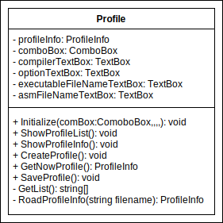

# 概要
- アプリ名: BenchmarkForCcompiler
- 開発者: 樫内蒼太朗
- アプリ概要: 自作コンパイラのデバッグをサポートするアプリ
- アプリの公開URL: [https://github.com/sotarokashiuchi/BenchmarkForCcompiler](https://github.com/sotarokashiuchi/BenchmarkForCcompiler)

# 経緯
私は普段、自作コンパイラを開発している。今回、自作コンパイラの開発の手助けとなるようなツールをC#で作成した。  
自作コンパイラは中間コードとしてアセンブリコードを出力する。自作コンパイラのデバッグは、自作コンパイラのコードをじっと見つめてバグを潰す場合もあるが、多くが既存のclangやgccのコンパイラの出力結果、バージョンの異なる自作コンパイラの出力結果と比較しデバッグを行う。そのため何度も、異なるコンパイラの、異なるオプションを指定し、名前の異なる中間コードや、実行ファイルを開き、比較する必要があり、非常に手間がかかる。そこでこれらの手間を無くし、快適に自作コンパイラのデバッグを行えるアプリを開発した。

# 機能
- 任意のソースコードをコンパイルし、実行することができる
- 中間ファイルのアセンブリコードを表示することができる
- コンパイル時の設定をプロファイルとして保存・読み込むことができる
- プロファイルの作成や編集、保存がおこなえる
- ソースコードの作成や編集、保存がおこなえる
- コンパイル結果、アセンブリコード、プログラム実行結果を分割画面で表示し、比較することができる
- コンパイル結果、アセンブリコード、プログラム実行結果をdiffで比較することができる

# チュートリアル
とりあえず動作させたい方向けに、チュートリアルを記します。詳細な使い方は、次項の「使い方」を読んでください。チュートリアルで使用しているプロファイルは、「gcc」とうコンパイラを使用しています。「gcc」のプログラムをインストールし、パスを通している状態でチュートリアルを進めてください。「gcc」以外のコンパイラを使用する場合は、別のプロファイルを使用してください。


1. 「BenchmarkForCompiler.exe」ファイルをダブルクリック
2. プロファイルAに「GCC Os」をプルダウンリストから選択
3. プロファイルBに「GCC O0」をプルダウンリストから選択
4. プログラムのパスの右横にある「参照」をクリックし、「sum.c」ファイルを選択
5. 「F5」キーをクリックすると、コンパイラの出力、アセンブリコード、プログラムの出力を見ることができる。２つのプロファイルのアセンブリを比較してわかるとおり、プロファイルAのほうが最適化処理レベルが高く、コード量が少ない
6. メニューバーの「表示」をクリックし、「表示モード」の「Diff表示」をクリックすると、実行結果の差分を取ることができる
7. 以上でチュートリアルは完了です。「使い方」を読み、より詳しい使い方を知ってください。

# 使い方
## ディレクトリ構成
このアプリのディレクトリ構成を次に示す
```
workfolder
|-- BenchmarkForCompiler.exe
|-- Profile
    |-- GCC O0
    |-- GCC O1
        ...

|-- SampleProgram
    |-- hello world.c
    |-- sum.c

```

## 起動方法
1. 「BenchmarkForCompiler.exe」ファイルをダブルクリック  


## プロファイルの選択、作成、保存
プロファイルとは、コンパイラを実行する時の設定ファイルです。`workfolder/Profile/`のディレクトリに保存されています。プロファイルを直接編集する場合は、このディレクトリの中のプロファイルをテキストエディターで編集すればよいです。アプリ上からもプロファイルの編集・作成・保存等の操作ができます。アプリ上での操作方法は主に3つあります。それぞれ説明します。


### 既存のプロファイルを使用する方法
1. 「プロファイルA」と「プロファイルB」のプルダウンリストから、任意のプロファイル名をクリックする
2. 「詳細を表示」のチェックを入れることで、今読み込まれているプロファイルの情報を表示することができる

### プロファイルの作成
1. 「プロファイルA」又は「プロファイルB」の右のテキストボックスに、プロファイルの名前を入力する
2. 「詳細を表示」のチェックを入れる
3. 「コンパイラのパス」を入力する
    - 実行するコンパイラがあるパスを入力する
    - パスが通っていないコンパイラの場合、絶対パスを指定する必要がある
4. 「オプション」を入力する
    - コンパイル時のオプションを入力する
    - アセンブリコードを生成するようなオプションを指定するとよい
5. 「実行ファイル名」を入力する
    - コンパイラによって生成される実行ファイル名を指定する
    - 実行ファイル名の拡張子だけを指定したい場合「*.exe」のように、アスタリスクを用いて入力する
6. 「アセンブラファイル名」を入力する
    - コンパイラによって生成される中間ファイルのアセンブリコード名を指定する
    - アセンブリコード名の拡張子だけを指定したい場合「*.s」のように、アスタリスクを用いて入力する
7. 「作成」をクリック

### 既存のプロファイルを編集する
1. 「プロファイルA」と「プロファイルB」のプルダウンリストから、任意のプロファイル名をクリックする
2. 「詳細を表示」のチェックを入れることで、今読み込まれているプロファイルの情報を表示することができる
3. 「コンパイラのパス」、「オプション」、「実行ファイル名」、「アセンブラファイル名」などのテキストボックス内を編集する
4. 「保存」をクリックする

## プログラムの選択
ここで説明するプログラムとは、コンパイラでコンパイルしたいソースコードのことを指します。
1. 「プログラムのパス」の右側のテキストボックスに、任意のプログラムを選択
2. 必要であれば「編集」ボタンをクリック
   - 簡易的なテキストエディターが開きます。
   - 本格的に編集したい場合は、VSCodeなどの専用のアプリで開き、編集してください。  
    

## 実行


### 一つずつ実行
1. 「コンパイルA実行」をクリック
    - コンパイルを実行します。
    - コンパイラによって、正しくコンパイルされると、何も表示しない場合があります。
2. 「アセンブラA表示」をクリック
    - アセンブリコードを表示します。
    - Intel記法のアセンブリを表示させたい場合などは、プロファイルの「オプション」で指定してください。
3. 「プログラムA実行」をクリック
    - コンパイルされた実行可能ファイルを実行します。
    - プログラムによって、何も表示されない場合があります。

### まとめて実行
1. メニューバーの「実行」をクリック
2. 実行するものを選択
    - ショートカットキーが使えます  
      

## 表示モードの変更
表示のモードには「比較表示」と「Diff表示」の２つのモードがあります。  
比較表示モードは、プロファイルAとプロファイルBの結果をそれぞれ左右に分割して表示させるモードです。  


Diff表示モードは、プロファイルAとプロファイルBの結果の差分を表示します。Aの結果が全て表示され、Bの結果はAの結果と異なる部分が表示されます。赤文字はAにはあるが、Bにはない文字列、緑文字はAにはないが、Bにはある文字列を表しています。文字列の背景色は、行全体の情報が表されています。赤色、緑色は文字の色と同様の意味を表しています。青色の背景は、赤色と緑色の文字の両方が含まれる場合の色です。


Diff表示モードを使用する場合、プロファイルAとプロファイルBを入れ替えると表示結果が異なります。Diff表示モードではプロファイルAの結果を基準にプロファイルBの結果を表示していることを忘れないでください。

### メニューバーから切り替える
1. メニューバーの「表示」をクリック
2. 「表示モード」をクリック
3. 「比較表示」又は「Diff表示」をクリック  


# プログラムの説明
このアプリのプログラムの説明を行います。まずはディレクトリ構成です。

## ディレクトリ構成
- Form1.cs
  - このファイルにはプログラムを実行したときに、一番初めに表示されるフォームのコードを記述した
- Form2.cs
  - このファイルにはテキストエディターのフォームのコードを記述した
  - Form1.csから呼び出されることによって、表示されるフォームである
- DiffMatchPatch.cs
  - このファイルには「Diff表示モード」のときの差分を取得するコードを記述した
  - このコードは[google/diff-match-patch](https://github.com/google/diff-match-patch)をベースにした
  - もともとのライブラリでは、行単位での差分を出力することができなかったため、独自のアルゴリズムを追加した

## プログラム概要
プログラムが実行されてから、終了するまでの大まかな流れを説明する
1. `Form1`クラスの先頭で、必要な各インスタンスを生成する
2. `Form1`のコンストラクタの処理で、生成したインスタンスの初期化を行う
3. `Form1_Load`メソッドで、初期状態を整える
4. 「textBox」や、「button」、「comboBox」、「checkBox」のイベント発生をトリガに、メソッドを呼び出す。Form1のクラス側では、動作の実装を定義せず、別のクラスに実装を分けた
5. Form1が閉じられると同時に呼び出される`Form1_Close`メソッドで、終了処理を行う

```csharp
namespace BenchmarkForCcompiler
{
    public partial class Form1 : System.Windows.Forms.Form
    {
        /* インスタンスの生成 */
        Profile profileA = new Profile();
        Profile profileB = new Profile();
        Compile compile = new Compile();
        Asm asm = new Asm();
        Executable executable = new Executable();
        Form2 form2 = new Form2();

        public Form1()
        {
            /* インスタンスの初期化処理 */
            InitializeComponent();
            profileA.Initialize(comboBox1, button3, button6, textBox2, textBox3, textBox6, textBox15);
            profileB.Initialize(comboBox2, button9, button10, textBox7, textBox9, textBox8, textBox14);
            compile.Initialize(richTextBox1, textBox4, richTextBox4, textBox4, richTextBox7);
            asm.Initialize(richTextBox2, textBox15, richTextBox5, textBox14, richTextBox8);
            executable.Initialize(richTextBox3, textBox6, richTextBox6, textBox8, richTextBox9);
        }

        private void Form1_Load(object sender, EventArgs e)
        {
            /* 初期設定適応 */
            // temp directory 作成
            Directory.CreateDirectory(@"temp" + ProfileStatus.ProfileA);
            Directory.CreateDirectory(@"temp" + ProfileStatus.ProfileB);

            // 比較表示
            比較表示ToolStripMenuItem.PerformClick();

            tableLayoutPanel2.Width = 000;
            tableLayoutPanel2.Height = 000;
            flowLayoutPanel2.Width = flowLayoutPanel2.Height = 0;
            tableLayoutPanel2.Refresh();
        }

        private void Form1_Close(object sender, EventArgs e)
        {
            /* 終了処理 */
            Directory.Delete(@"temp" + ProfileStatus.ProfileA, true);
            Directory.Delete(@"temp" + ProfileStatus.ProfileB, true);
        }

        private void comboBox1_SelectedIndexChanged(object sender, EventArgs e)
        {
            profileA.ShowProfileInfo();
        }

        private void button3_Click(object sender, EventArgs e)
        {
            profileA.CreateProfile();
            profileA.ShowProfileList();
            profileB.ShowProfileList();
        }

        private void diff表示ToolStripMenuItem_Click(object sender, EventArgs e)
        {
            diff表示ToolStripMenuItem.Checked = true;
            比較表示ToolStripMenuItem.Checked = false;
            changeViewMode(false);
            compile.Comparison(profileA.GetNowProfile(), profileB.GetNowProfile());
            asm.Comparison();
            executable.Comparison();
        }

        /* 省略 */
    }
}
```

## クラス図とコード
使用したクラスの中で特にプログラムを説明するにあたり、重要なクラスを紹介する。図はUMLのクラス図の記法を参考に書いた。

### Profileクラス

- プロファイルの管理を行うクラス
- プロファイルAとプロファイルBで必要な処理をまとめている
- プロファイルの読み込み、表示、作成、取得を行う

```csharp
class Profile
{
    /* プロファイルの全ての情報を格納する構造体の定義 */
    public struct ProfileInfo
    {
        public string ProfileName;
        public string Compiler;
        public string Option;
        public string ExecutableFileName;
        public string AsmFileName;
        /* 省略 */
    }

    private ProfileInfo profileInfo = new ProfileInfo();
    private System.Windows.Forms.ComboBox comboBox;
    private System.Windows.Forms.TextBox compilerTextBox;
    private System.Windows.Forms.TextBox optionTextBox;
    private System.Windows.Forms.TextBox executableFileNameTextBox;
    private System.Windows.Forms.TextBox asmFileNameTextBox;

    /* 初期化 */
    public void Initialize(System.Windows.Forms.ComboBox comboBox, ,,,,){  }

    /* comboBoxのリストに追加 */
    public void ShowProfileList(){ }

    /* プロファイルを表示 */
    public void ShowProfileInfo(){ }

    /* プロファイル作成 */
    public void CreateProfile(){ }

    /* 現在のプロファイル */
    public ProfileInfo GetNowProfile(){ }

    /* プロファイルの保存 */
    public void SaveProfile(){ }
}
```

### BulidBaseClassクラス

- このアプリのメインの処理を行うクラス
- 「コンパイル実行」、「アセンブラ表示」、「プログラム実行」の処理は、必要なオブジェクトの数と、処理が似ているため、BuildBaseClassクラスというい抽象クラスを定義し、抽象クラスの派生クラスとして、それぞれ「Compile」、「Asm」、「Executable」というクラスを定義
- メンバ変数や、Initializeメソッドなどは継承を用い、共通化させた
- Runメソッドは、各クラスで異なる動作をするので、オーバーライド機能とオーバーロード機能を用い、同一の関数名だが、各クラスで実装が異なるようにした。

```csharp
public enum ProfileStatus
{
    ProfileA,
    ProfileB,
}

/* 抽象クラス */
abstract class BuildBaseClass
{
    protected System.Windows.Forms.RichTextBox outputRichTextBox;
    protected System.Windows.Forms.TextBox inputFileNameTextBox;
    protected System.Windows.Forms.RichTextBox ProfileA_OutputRichTextBox;
    protected System.Windows.Forms.TextBox ProfileA_InputFileNameTextBox;
    protected System.Windows.Forms.RichTextBox ProfileB_OutputRichTextBox;
    protected System.Windows.Forms.TextBox ProfileB_InputFileNameTextBox;
    protected System.Windows.Forms.RichTextBox ComparisonRichOutputTextBox;

    /* 初期化 */
    public void Initialize(System.Windows.Forms.RichTextBox ProfileA_OutputRichTextBox, ,,,){ }

    /* 抽象メソッド */
    abstract public void Run(ProfileStatus profileStatus);

    public void Comparison()
    {
        // 抽象メソッドを呼び出し可能
        Run(ProfileStatus.ProfileA);
        Run(ProfileStatus.ProfileB);
        comparison.GitDiff(ProfileA_OutputRichTextBox.Text.Replace("\n", Environment.NewLine), ProfileB_OutputRichTextBox.Text.Replace("\n", Environment.NewLine), ComparisonRichOutputTextBox);
    }
}

/* 抽象クラスを継承したクラス */
class Compile : BuildBaseClass
{
    /* オーバーロード機能を使用し、Run()を再定義 */
    public void Run(ProfileStatus profileStatus, Profile.ProfileInfo profileInfo){ }
    
    public void Comparison(Profile.ProfileInfo profileInfoA, Profile.ProfileInfo profileInfoB) { }
}

/* 抽象クラスを継承したクラス */
class Asm : BuildBaseClass
{
    /* オーバーライド機能を使用し、Run()を実装 */
    public override void Run(ProfileStatus profileStatus){ }
}

/* 抽象クラスを継承したクラス */
class Executable : BuildBaseClass
{
    /* オーバーライド機能を使用し、Run()を実装 */
    public override void Run(ProfileStatus profileStatus){ }
}
```

## クラスとインスタンス
ここで生成されるインスタンスと、クラスのメンバ変数を対応付けた図を示す。ここからも、クラスの有用性が伺える。

### Profileクラス


### BulidBaseClassクラス


# 工夫点
いくつかプログラムの工夫点を紹介する。

## 例外処理
ユーザーの操作ミスにより、例外(実行時エラー)が発生したり、動作しないプログラムになったりする場合がある。そのたびに毎回プログラムが停止し、作業していた内容が全て消えると、二度手間だ。そこでプログラムを停止することなく、ユーザにエラーを報告し、修正してもらうようにプログラムした。いくつか例を示す。

- 例1: コンパイルのパスが入力されていません  
  
  - 「プロファイル」を指定せずに、「コンパイル実行」をクリックすると発生
- 例2: プログラムのパスが入力されていません  
  
  - 「プログラムのパス」を入力せずに、「編集」ボタンをクリックし、テキストエディタを開こうとした場合に発生
- 例3: ファイルが未保存です  
  
  - テキストエディタで、ファイルを保存せずに、フォームを閉じようとした場合に発生
- 例4: 既に同じ名前のプロファイルが存在しています  
  
  - 同じ名前のプロファイルを「作成」しようとした場合に発生

例外処理の実装方法は、`try catch finally`構文を使用した。以下のように、例外が発生しそうなコードを`try`で囲む。例外が発生した場合、例外の種類に応じて、`catch`の処理が行われる。`finally`は全ての場合に実行されるコードであり、リソースの開放などを行う。

```csharp
public override void Run(ProfileStatus profileStatus)
{
    switchProfile(profileStatus);
    StreamReader sr = null;
    try
    {
        sr = new StreamReader(@"temp" + profileStatus + @"\" + matchFileName(profileStatus, inputFileNameTextBox.Text), Encoding.GetEncoding("UTF-8"));
        outputRichTextBox.Text = sr.ReadToEnd();
        sr.Close();
    }
    catch (ArgumentException ex)
    {
        // ファイル名を指定していない
        MessageBox.Show(
            "「アセンブラファイル名」が入力されていません。",
            "エラー",
            MessageBoxButtons.OK,
            MessageBoxIcon.Error
        );
        Console.WriteLine(ex.Message);
    }
    catch(IOException ex) {
        // ファイル名が不正
        MessageBox.Show(
            "「アセンブラファイル名」に使用できない文字が含まれています",
            "エラー",
            MessageBoxButtons.OK,
            MessageBoxIcon.Error
        );
        Console.WriteLine(ex.Message);
    }
    finally
    {
        sr?.Close();
    }
}
```

## 少し便利な機能
なくてもよいが、あったら便利な機能をいくつか実装したので、紹介する。
- 例1: テキストエディタのアスタリスクの表示
  - テキストエディターを開くとウィンドウの上部にファイル名が表示される
  - テキストを編集し未保存の場合、ファイル名の右側に「*(アスタリスク)」が表示される  
  
- 例2: ショートカットキーの実装
  - メニューバーの「実行」や「表示」、「ファイル」をクリックする
  - メニューの右側に表示されるのがショートカットキー  
  

## diff処理
一番工夫したのは、「Diff表示モード」の差分を表示する機能。[google/diff-match-patch](https://github.com/google/diff-match-patch)では行単位の差分を取得することができなかった。そこで独自のメソッドを作成し、行単位での差分を表示できるようにした。配列や可変長のサイズにできるリストを用いて記述した。またTextBoxではなくRichTextBoxを使い、差分がある部分にわかりやすいように色を付けた  

